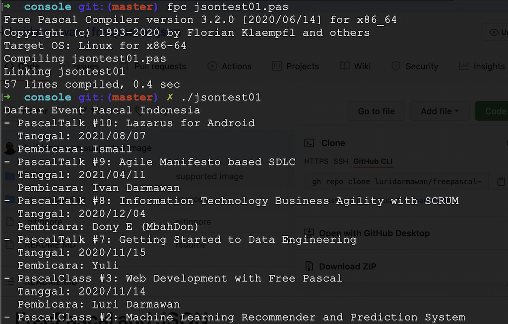

# FreePascal and JSON

JSON merupakan salah satu standar dalam proses pertukaran data antar aplikasi. Dan pada dasarnya sungguh sangat mudah mengolah data json ini di bahasa pemrograman Pascal, terlebih sudah banyak yang menyediakan _helper_ untuk mempermudah proses baca tulisnya.

Semua yang diperlukan sudah terakomodir di dalam freepascal tanpa perlu install pustaka tambahan lainnya.

Tulisan ini mengilustrasikan proses membaca suatu data dari suatu API yang menghasilkan data berformat json. Dalam hal ini saya menggunakan [data publik daftar event](https://github.com/pascal-id/Public-Data) di [Komunitas Pascal Indonesia](https://pascal-id).
Jika ingin melihat data aslinya silakan coba akses langsung dari repository [https://raw.githubusercontent.com/pascal-id/Public-Data/master/data/events.json](https://raw.githubusercontent.com/pascal-id/Public-Data/master/data/events.json).

## Begin


Baiklah, langsung saja, kode sumber ini akan membaca data dari endpoint api di
`https://raw.githubusercontent.com/pascal-id/Public-Data/master/data/events.json`

Dengan data seperti ini

```js
{
  "data": [
    {
      "name": "PascalTalk #10: Lazarus for Android",
      "date": "2021/08/07",
      "time": "19:00 - 21:00",
      "type": "PascalTalk",
      "speaker": [
        {
          "name": "Ismail",
          "title": ""
        }
      ],
      "banner": "20210807.jpg",
      "url": "",
      "description": "Kali ini Pascal Indonesia akan kembali mengadakan PascalTalk #10 yang kali ini akan membahas tentang Lazarus for Android. kita akan membahas bagaimana lazarus dapat beraksi di platform android dan mengikuti gaya terkini. Acara ini akan dibawakan oleh Mas Ismail yang merupakan penggiat Pascal Indonesia. Acara ini akan live di facebook Pascal Indonesia.",
      "others": {
        "Registration_url": "https://web.facebook.com/events/947060502809991/",
        "Presentation_url": "https://github.com/pascal-id/Public-Data/blob/master/files/presentation/10-lamw_presentation.odp",
        "Video_url": ""
      }
    },
    .
    .
    .
    
  ]
}    
```

Kita akan melakukan _looping_ untuk membaca isi larik dari key yang bernama `data` dan cukup hanya menampilkan nama event, tanggal dan pematerinya dari setiap _record_ data yang ada.

Dan kurang lebih hasil kode sumbernya akan seperti ini:

```pascal
program jsontest01;

{$mode objfpc}{$H+}

uses
  fpjson,
  jsonparser,
  fphttpclient,
  opensslsockets,
  SysUtils;

const
  EVENT_LIST_URL =
    'https://raw.githubusercontent.com/pascal-id/Public-Data/master/data/events.json';

var
  rawData: ansistring;
  rawDataAsJson: TJSONData;
  events: TJSONArray;
  eventEnum: TJSONEnum;
  event: TJSONObject;

begin
  // Baca data json
  try
    rawData := TFPHTTPClient.SimpleGet(EVENT_LIST_URL);
  except
    on E: Exception do
    begin
      WriteLn('Gagal membaca sumber data: ' + E.Message);
      Exit;
    end;
  end;

  // Konversi data string menjadi object json
  try
    rawDataAsJson := GetJSON(rawData);
  except
    on E: Exception do
    begin
      WriteLn('Informasi tidak valid: ' + E.Message);
      Exit;
    end;
  end;

  // Tampilkan nama event, tanggal dan pemateri
  WriteLn('Daftar Event Pascal Indonesia');
  events := TJSONArray(rawDataAsJson.FindPath('data'));
  for eventEnum in events do
  begin
    event := TJSONObject(eventEnum.Value);
    WriteLn('- ' + event.Strings['name']);
    WriteLn('  Tanggal: ' + event.Strings['date']);
    WriteLn('  Pembicara: ' + event.FindPath('speaker[0].name').AsString);
  end;

end.
```

Pada dasarnya, untuk melakukan proses pengolahan data json, kita cukup menggunakan unit `fpjson` dan `jsonparser`. Sedangkan untuk pemanggilan api-nya cukup dengan unit `fphttpclient`, dengan catatan perlu memasukkan unit `opensslsockets` jika url menggunakan ssl.

Jika dilihat dari kode sumbernya, `GetJSON` digunakan untuk mengkonversi data string menjadi objek data json. Dan kemudian membaca data _array_ dari field `data`.

```
events := TJSONArray(rawDataAsJson.FindPath('data'));
```

Dari sini kemudian kita menggunakan `TJSONEnum` untuk membantu mengurai data lariknya agar mudah membaca masing-masing `field`-nya.

Akan bisa dilihat juga variasi cara membaca data dengan `event.Strings` atau `event.FindPath('speaker[0].name').AsString`. Silahkan disesuaikan penggunaannya.

Hasil akhirnya nanti kurang lebih akan seperti ini:


Nahhh .... seperti yang terlihat, **mudah** khan cara membaca **data JSON** di FreePascal/Lazarus.

Artikel repositori ini telah tayang di situs [Komunitas Pascal Indonesia](https://www.pascal-id.org/news/370/freepascal-json).

## End.
